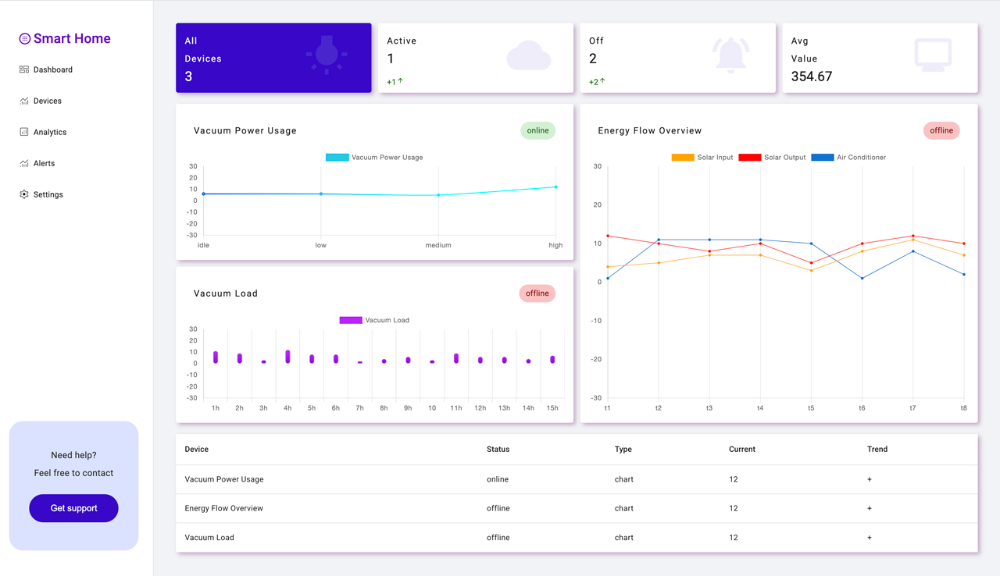

# Dashboard

Status: Work in progress (main view implemented, UI and architecture evolving)

A real-time dashboard for monitoring home input/output and device status

- Real-time device updates via Websocket
- Signal-based state management
- Chart visualization of smart home data

Technologies:

- Angular
- Node
- Web Socket
- express
- Angular Material
- Chart.js

## How to run

npm install
npm run backend
ng serve

## Build

Run `ng build` to build the project. The build artifacts will be stored in the `dist/` directory.
